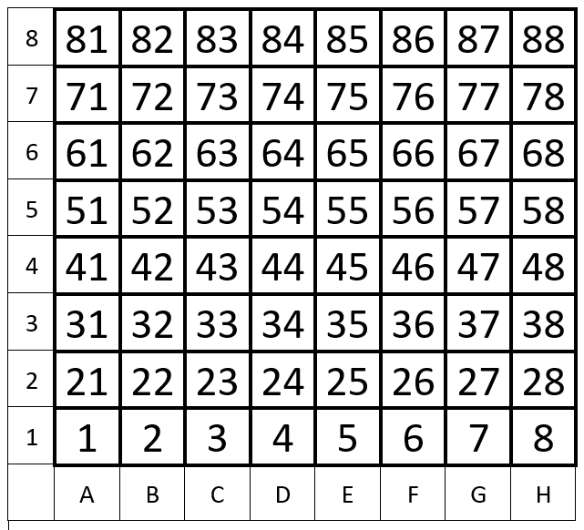
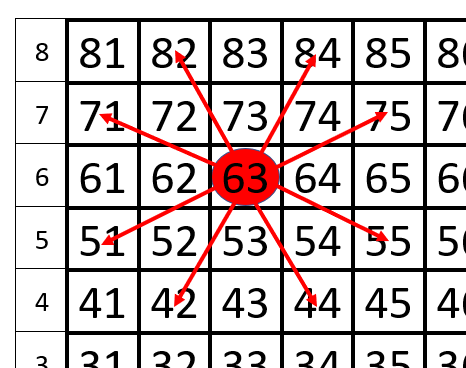

# **Задача о ходе коня (Knight’s Tour Problem)**

## **Описание**
Задача о нахождении маршрута шахматного коня, проходящего через все поля доски по одному разу, решена с использование правила Варнсдорфа.
___
***Правило Варнсдорфа:*** *при обходе доски конь следует на то поле, с которого можно пойти на минимальное число ещё не пройденных полей. Если таких полей несколько, то можно пойти на любое из них.*
___
## **Алгоритм**
Доска представляет список целых чисел, в соответствии с рисунком:
\
При перемещении коня на новое поле доски из списка удаляется соответствующий элемент.

Варианты ходов коня по доске представляют список, элементами которого являются целые числа, полученные как разность номера текущего поля, в котором сейчас находится конь, и полем, куда можно переместить коня. В нашем случае это константы 21, 19, 12, 8, -8, -12, -19, -21\

**Алгоритм движения коня:**
- Первый ход - постановка коня на доску (начальное поле). Данный номер поля удаляется из списка элементов доски.
- Из начального поля находятся поля, на которых конь еще не был.
Для каждого найденного поля вычисляется рейтинг (количество дальнейших возможных ходов). Выбирается поле с минимальным рейтингом. Если таких полей несколько, то выбирается любое (реализован случайный выбор).
- Конь переходит на новое поле.
- Все повторяется сначала, пока есть куда ходить (пока список доски содержит элементы).
