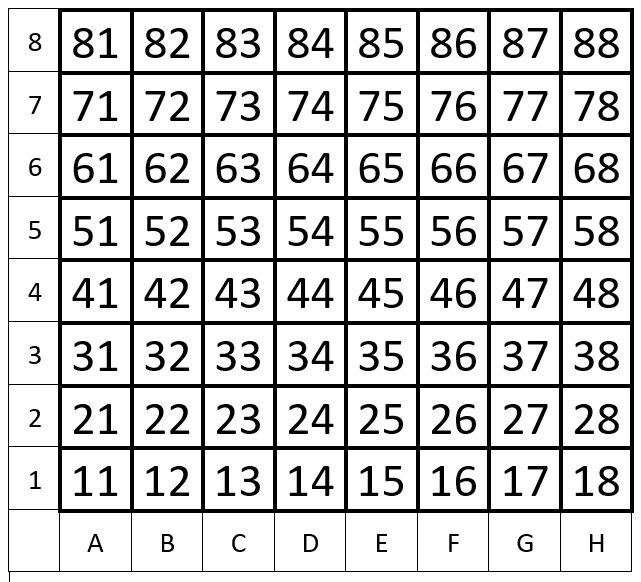
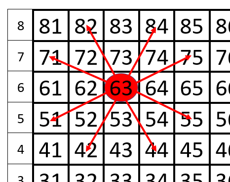

# **Задача о ходе коня**

## **Описание**
Задача о нахождении маршрута шахматного коня, проходящего через все поля доски по одному разу, решена с использованием правила Варнсдорфа.
___
***Правило Варнсдорфа:*** *при обходе доски конь следует на то поле, с которого можно пойти на минимальное число ещё не пройденных полей. Если таких полей несколько, то можно пойти на любое из них.*
___
## **Алгоритм**
Доска представляет список целых чисел, в соответствии с рисунком:
\
При перемещении коня на новое поле доски из списка удаляется соответствующий элемент.

Варианты ходов коня по доске представляют список, элементами которого являются целые числа, полученные как разность номера текущего поля, в котором сейчас находится конь, и полем, куда можно переместить коня. В нашем случае это константы 21, 19, 12, 8, -8, -12, -19, -21\

**Алгоритм движения коня:**
- Первый ход - постановка коня на доску (начальное поле). Первый ход реализован случайным выбором из всех полей доски. Данный номер поля удаляется из списка элементов доски.
- Из начального поля находятся поля, на которых конь еще не был.
Для каждого найденного поля вычисляется рейтинг (количество дальнейших возможных ходов). Выбирается поле с минимальным рейтингом. Если таких полей несколько, то выбирается любое (реализован случайный выбор).
- Конь переходит на новое поле.
- Все повторяется сначала, пока есть куда ходить (пока список доски содержит элементы).
___
___
___

# **Knight’s Tour Problem**

## **Description**
The problem of finding the route of a chess knight passing through all the fields of the board once is solved using the Warnsdorff rule.
___
***The Warnsdorf Rule:*** *when going around the board, the knight should go to the field from which it is possible to go to the minimum number of fields not yet passed. If there are several such fields, then you can go to any of them.*
___
## **Algorithm**
The board represents a list of integers, according to the drawing:
\
When a knight is moved to a new board field, the corresponding element is removed from the list.

The options for the knight's moves on the board represent a list, the elements of which are integers obtained as the difference between the number of the current field in which the knight is currently located and the field where the knight can be moved. In our case, these are constants 21, 19, 12, 8, -8, -12, -19, -21\

**The algorithm of the horse's movement:**
- The first move - placing the knight on the board (the initial field). The first move is implemented by randomly selecting from all fields of the board. This field number is removed from the list of board elements.
- From the initial field, there are fields where the knight has not been yet.
For each field found, a rating is calculated (the number of further possible moves). The field with the lowest rating is selected. If there are several such fields, then any one is selected (random selection is implemented).
- The knight moves to a new field.
- Everything repeats over again until there is somewhere to go (as long as the board list contains items).
